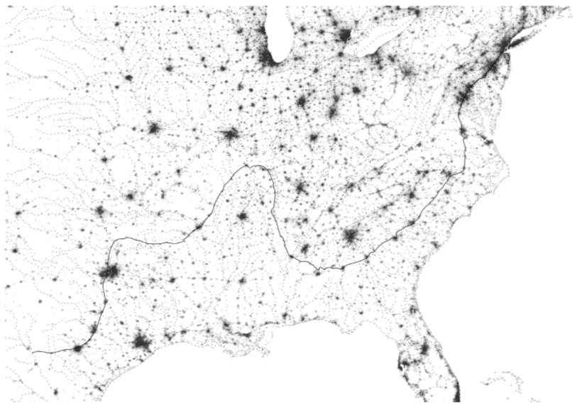
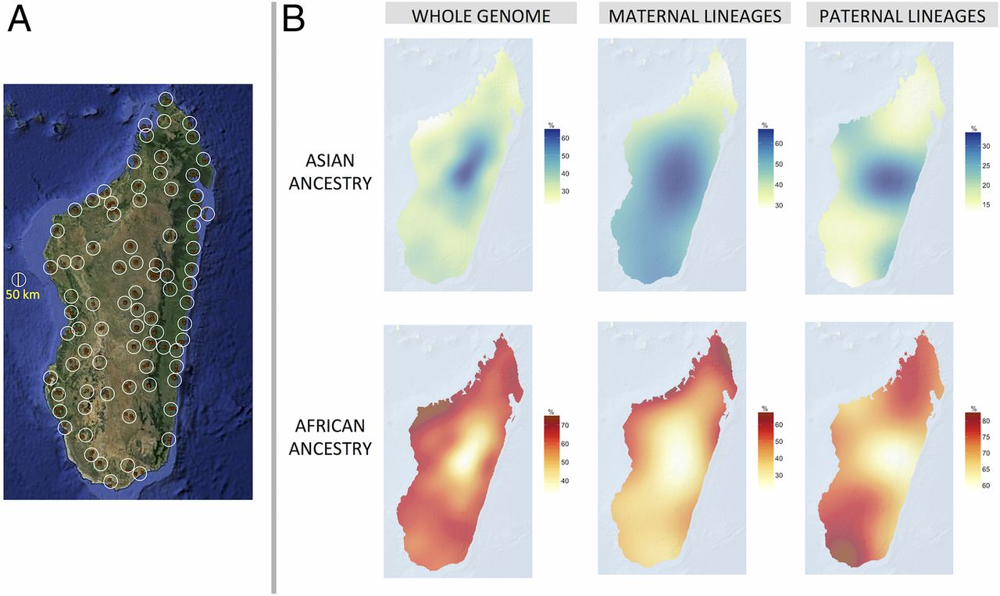
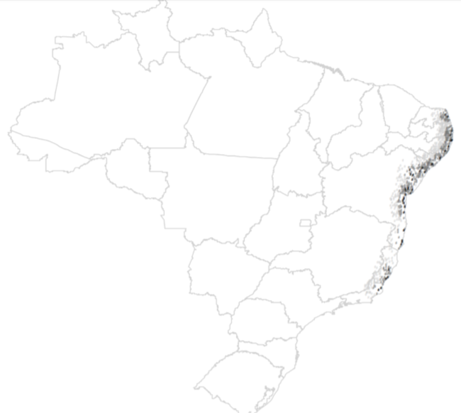
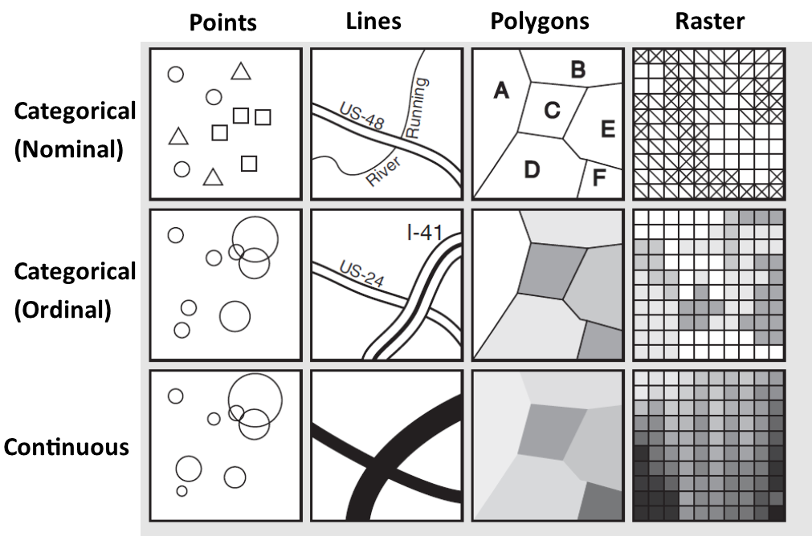

<style>
.column-left{
  float: left;
  width: 50%;
  text-align: left;
}
.column-right{
  float: right;
  width: 50%;
  text-align: right;
}
</style>


```{r setup, include=FALSE}
knitr::opts_chunk$set(echo = FALSE)
library(tidyverse)
library(knitr)
library(sf)
library(leaflet)
library(mapview)
#world <- read_sf("world_shapefile/ne_50m_admin_0_countries.shp")
```

## Geography

- What is your favourite sport?
- Do you speak Spanish?
- Do you know who Fofão is?
- How many kisses on the cheek do you greet someone with?
- If you are on your own in a taxi do you sit in the front or back?
- Do you think government policy should allow free migration?
- Where do you live?

## Geography

- Knowledge and communication depend on where we live

- Social norms and customs depend on where we live

- Political preferences depend on where we live

## Geography

- Tobler's First Law of Geography:

*"Everything is related to everything else, but near things are more related than distant things"*

## Geography

- What does 'near' mean?

- Concepts of distance:
    - Euclidean
    - Great Circle
    - Manhattan
    - Levensthtein
    - Mahalanobis
    - Driving
    - Network
    - Minimum-cost
    - Genetics
    
## Geography

- What does 'related' mean?
    - Correlated
    - More similar
    - More different (ex. dialing codes to avoid typing errors)

- 'Related' does not mean one person 'causes' a similar effect on another
    - It may just be a common response to a similar environment
    
## Geography

- [Map of spatial autocorr]

## Geography

<iframe width="1600" height="700" src="https://pudding.cool/2018/10/city_3d/?fbclid=IwAR3GQtk3MgbwW3jMTNauYkzI82riDbJ8VnpXEREwuj3FPTwq21LaiMgbOKA" allowfullscreen></iframe>

## Geography

<iframe width="1200" height="550" src="https://www.nytimes.com/interactive/2015/07/08/us/census-race-map.html" allowfullscreen></iframe>

https://www.nytimes.com/interactive/2015/07/08/us/census-race-map.html

## Geography

```{r, out.width="750px", fig.cap="", fig.align="center"}
include_graphics("Snow_Cholera.png")
```

## Geography

<iframe width="1200" height="550" src="http://especiais.g1.globo.com/politica/eleicoes/2018/mapa-da-apuracao-no-brasil-presidente/1-turno/" allowfullscreen></iframe>


## Geography

- But isn't the world getting smaller? 
    - 'The death of distance'
    - Everything is 'near' on the internet
    
- Relevant distances may be changing
    - Cost of flights instead of kilometres or hours
    - Language and social network instead of proximity to radio tower

- Spatial relationships take place at **multiple scales**
    - I am Welsh, British, European etc.
    - The similarities between rural China and rural Russia are greater than the differences

## Geography

- Geography is more than just 'clustering'
    
- A Typology of Spatial Relationships    
    1. Clustering
    2. Natural resources/barriers
    3. Administrative barriers

## Geography

- Physical features also affect social and political processes
    - Attracting economic activity
    - Preventing interactions

## Geography
    
```{r, out.width="750px", fig.cap="", fig.align="center"}

```    

## Geography

```{r, out.width="750px", fig.cap="", fig.align="center"}

```

## Geography

```{r, out.width="750px", fig.cap="", fig.align="center"}

```

## Merits of Spatial Analysis

## Map Literacy

## Geographic Information Systems

1. Convert the real world into a digital model
    - Necessarily simplified

2. Compare multiple spatial layers

3. Create measures and statistics to describe spatial relationships

## Vector vs. Raster Data

<div class="column-left">
- Vector
    - Start with a blank page
    - Add specific **objects** (points, lines, polygons) defined by coordinates (x,y)
    - The computer stores just the coordinates of the objects
    - Non-spatial 'Attributes' of each object allow complex analyses
</div>

<div class="column-right">
- Raster
    - Start with a grid
    - Each grid square (pixel) has a value
    - The computer stores one value for every grid square (fixed memory size)
    - Mostly for 'continuous' remote sensing (satellite) images
</div>

## Vector vs. Raster Data

```{r, out.width="750px", fig.cap="", fig.align="center"}
include_graphics("OS_Map.png")
```    

## Types of Vector Data

Type | Dimensions | 
----------------------------
Point | 0 | 
Line | 1 | 
Polygon | 2 | 

- An analysis choice, and depends on scale

## Types of Vector Data

- The attributes we assign to vector objects also vary

```{r, out.width="750px", fig.cap="", fig.align="center"}

```

## Describing Space

1. Coordinate System
2. Datum
3. Projection

