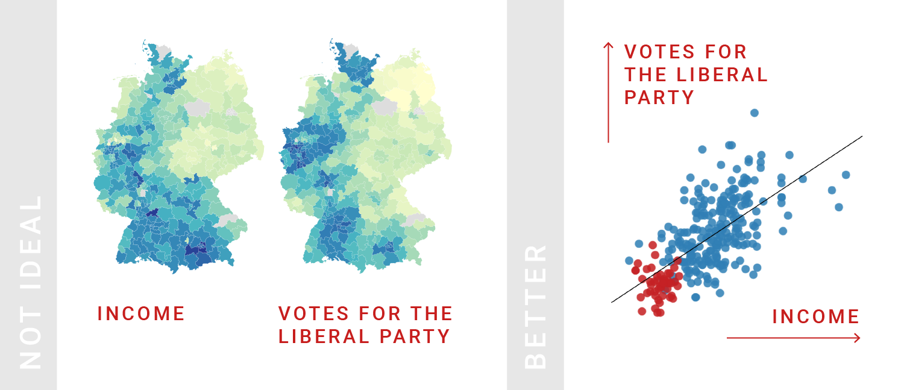
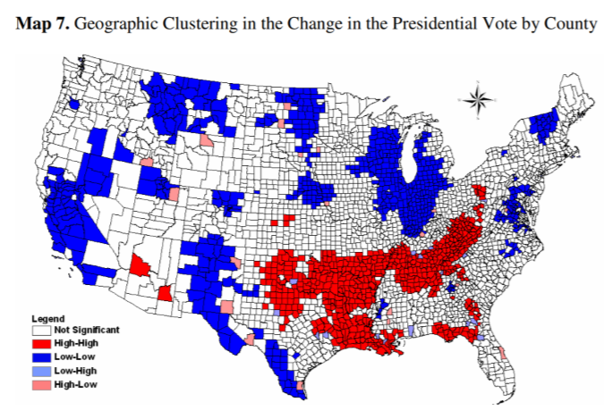
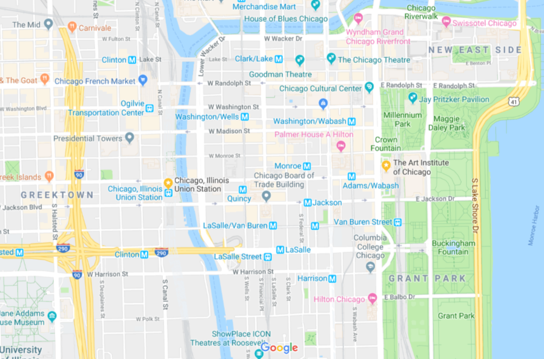
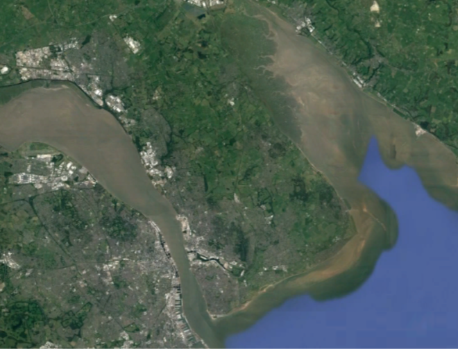
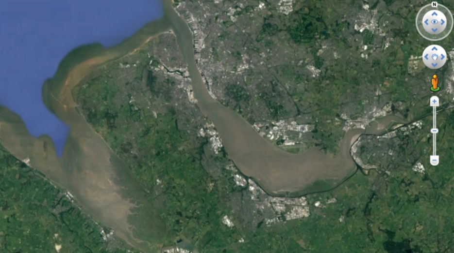
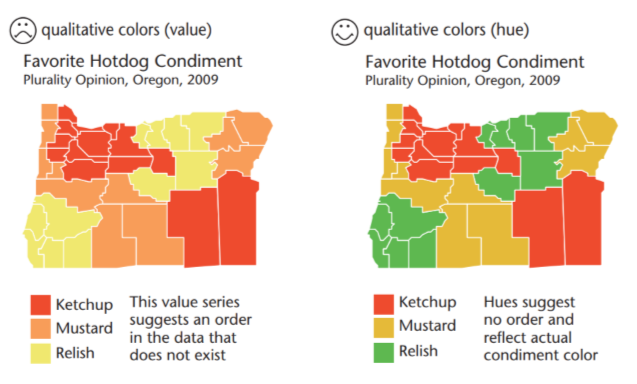
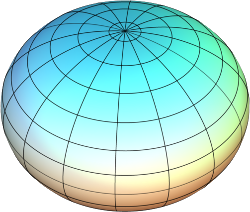
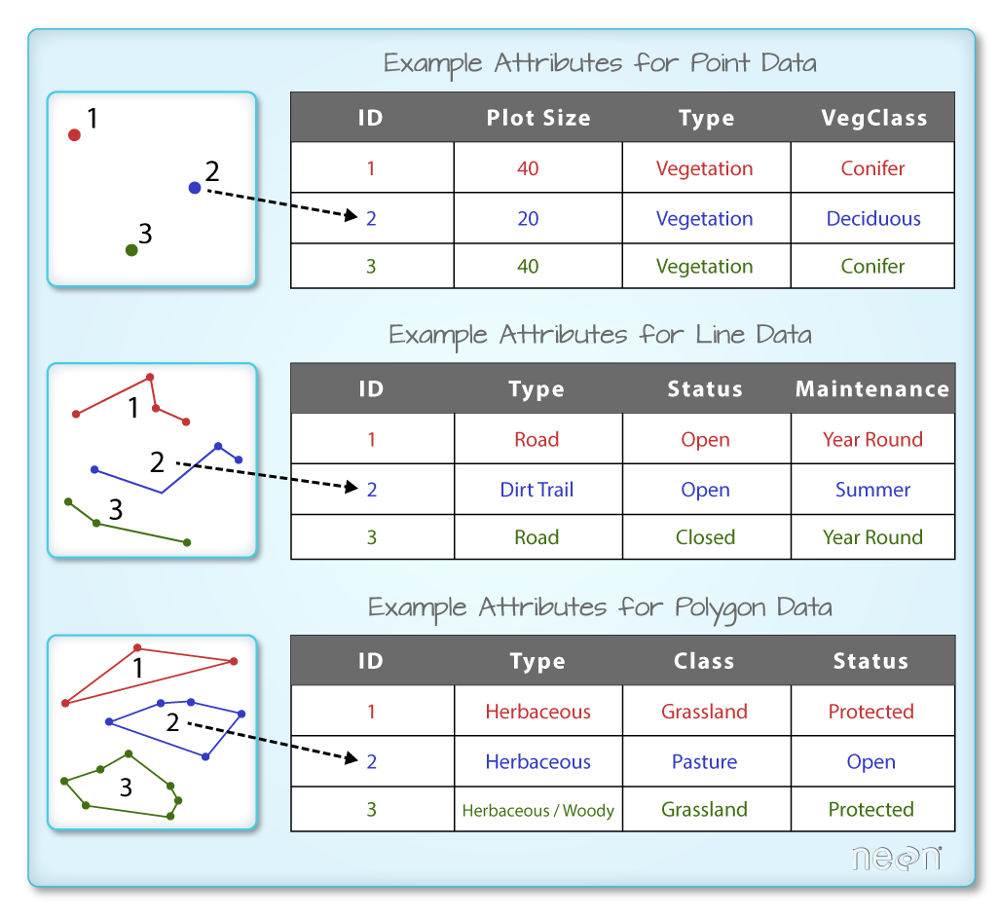
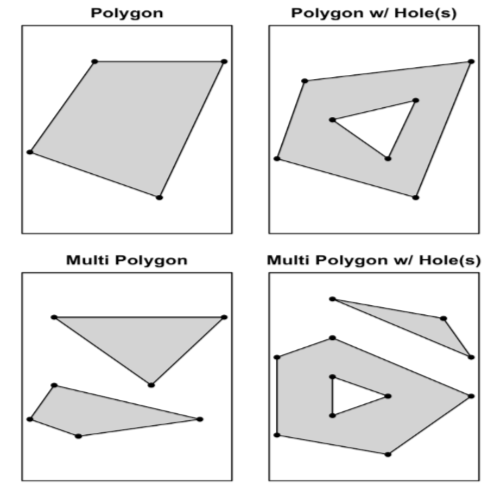

<style>
.column-left{
  float: left;
  width: 50%;
  text-align: left;
}
.column-right{
  float: right;
  width: 50%;
  text-align: right;
}
</style>


```{r setup, include=FALSE}
knitr::opts_chunk$set(echo = FALSE, warning=F, message=F)
library(tidyverse)
library(knitr)
library(sf)
library(leaflet)
library(mapview)
library(xtable)
#world <- read_sf("world_shapefile/ne_50m_admin_0_countries.shp")
```

## Geography

- What is your favourite sport?
- Do you speak Spanish?
- Do you know who Fofão is?
- How many kisses on the cheek do you greet someone with?
- If you are on your own in a taxi do you sit in the front or back?
- Do you think government policy should allow free migration?
- Where do you live?

## Geography

- Knowledge and communication depend on where we live

- Social norms and customs depend on where we live

- Political preferences depend on where we live

## Geography

Tobler's First Law of Geography:

*"Everything is related to everything else, but near things are more related than distant things"*

## Geography

- What does 'near' mean?

- Concepts of distance:
    - Euclidean
    - Great Circle
    - Manhattan
    - Levensthein
    - Mahalanobis
    - Driving
    - Network
    - Minimum-cost
    - Genetics
    
## Geography

- What does 'related' mean?
    - Correlated
    - More similar
    - More different (ex. dialing codes to avoid typing errors)

<br> </br>

- 'Related' does not mean one person 'causes' a similar effect on another
    - It may just be a common response to a similar environment
    - But interactions and spillovers are common

## Geography

- Locations of 'Events' could be 'near' to each other

```{r, out.width="750px", fig.cap="", fig.align="center"}
include_graphics("Snow_Cholera.png")
```

## Geography

- Or *characteristics* of locations could be 'near' to each other

```{r, out.width="600px", fig.cap="", fig.align="center"}

```

## Geography

- Multiple characteristics could also be 'near' to each other
    
```{r, out.width="1400px", fig.cap="", fig.align="center"}

```

## Geography

<iframe width="1600" height="700" src="https://pudding.cool/2018/10/city_3d/?fbclid=IwAR3GQtk3MgbwW3jMTNauYkzI82riDbJ8VnpXEREwuj3FPTwq21LaiMgbOKA" allowfullscreen></iframe>

## Geography

<iframe width="1600" height="700" src="https://demographics.virginia.edu/DotMap/" allowfullscreen></iframe>

## Geography

<iframe width="1600" height="700" src="https://storymaps.esri.com/stories/2018/mapping-incomes/index.html" allowfullscreen></iframe>

## Geography

- But isn't the world getting smaller? 
    - 'The death of distance'
    - Everything is 'near' on the internet
    
- Relevant distances may be changing
    - Cost of flights instead of kilometres or hours
    - Language and social network instead of proximity to radio tower

- Spatial relationships take place at **multiple scales**
    - I am Welsh, British, European etc.
    - The similarities between rural China and rural Russia are greater than the differences

## Geography

- Lots of interesting questions are really non-spatial
    - We can draw maps of them
    - But the conclusion does not depend on the *locations* of the units
    
Non-spatial Question    | Question Requiring Spatial Analysis
------------------------|---------------------
How many countries have had cases of ebola? (11) | Which part of Africa was affected by ebola (West and Central)?
What is the population of the USA? (~325m) | How many people live West of the Mississippi? (~136m)
Which state in Brazil is richest? (DF) | Where in Brazil are states richest? (Southeast)

## Spatial Political Science Questions

- Politics is about "who gets what, when and how" (Laswell 1936)
    - And "where"

- The 'outcomes' of politics are spatial
    - Northern Brazil is poorer than the South
    - A child born just inside the border of North Korea has fewer rights

- The 'causes' of politics are also spatial
    - 78% of China's GDP located in its cities
    - Social networks are spatially concentrated

- Political decision-making is arranged by space

## Spatial Political Science Questions

- Types of spatial political analysis
    1. Identifying clustering
        - Eg. Seabrook (2009)
  
```{r, out.width="720px", fig.cap="", fig.align="center"}

```  
  
## Spatial Political Science Questions

- Types of spatial political analysis
    2. Correlating spatial relationships
        - Eg. Acharya, Blackwell and Sen (2016)

```{r, out.width="850px", fig.cap="", fig.align="center"}

```

## Spatial Political Science Questions

- Types of spatial political analysis
    3. Measuring how one country affects its neighbours
        - Eg. Oberdabernig et al (2017)

```{r, out.width="950px", fig.cap="", fig.align="center"}

```

## Spatial Political Science Questions

- Types of spatial political analysis
    4. How natural geography affects politics
        - Eg. Bleakley et al 2010

```{r, out.width="680px", fig.cap="", fig.align="center"}
include_graphics("Fall_Line_Cities.png")
```

## Spatial Political Science Questions

- Types of spatial political analysis
    5. How political borders affect modern politics
        - Eg. Dell (2010)

```{r, out.width="600px", fig.cap="", fig.align="center"}

```

## Spatial Political Science Questions

- Types of spatial political analysis
    5. How political borders affect modern politics

```{r, out.width="500px", fig.cap="Source: The Economist", fig.align="center"}

```

## Merits of Spatial Analysis

<div class="column-left">
Opportunities:

- Deeper explanations for common outcomes
- Where helps us understand why
- Avoid confounding relationships
- Enabling new inferential methodologies
</div>

<div class="column-right">
Limitations:

- Data are not 'independent' for statistical analysis
- Data are often aggregated, and the level of aggregation affects our conclusions (Modifiable Areal Unit Problem, Ecological Fallacy)
- Distances of complex shapes are not 'fixed' (fractals)
</div>

## Merits of Spatial Analysis

```{r, out.width="500px", fig.cap="", fig.align="center"}

```

## Map Literacy

- Maps are **clear** and **convincing**
    - Patterns may only be visible when arranged spatially
    - If you have *spatial* data, why put it in a table or a chart?

## Map Literacy

- Eg. The population of Acre state by municipality:

```{r, results='asis'}
library(stargazer)

mun <- readRDS("mun2.rds") %>% st_as_sf()
mun <- mun %>% filter(UF=="AC")

mun %>% dplyr::select(GEOCOD,NOME_AC,POP_2010) %>% st_set_geometry(NULL) %>% arrange(-POP_2010) %>% stargazer(type="html", summary=F)
```

## Map Literacy

```{r}
mun %>% st_set_geometry(NULL) %>% ggplot() +
  geom_col(aes(x=NOME_AC,y=POP_2010)) +
  theme_classic() +
  theme(axis.text.x = element_text(angle=90)) +
  xlab("Municipality") +
  ylab("Population 2010")
```

## Map Literacy

```{r}
mun %>% ggplot() +
  geom_sf(aes(fill=POP_2010)) +
  theme_minimal() +
  coord_sf(datum=NULL) +
  scale_fill_continuous(low="white",high="red",trans="log")
```

## Map Literacy

- But maps still require careful interpretation
    - Scale
    - Direction
    - Indicator
    - Mapping values to colours

## Map Literacy

- Scale
    - Can I walk from The Art Institute of Chicago to Union Station in 10 minutes?
    
```{r, out.width="700px", fig.cap="", fig.align="center"}

```

## Map Literacy

- Scale

```{r, out.width="900px", fig.cap="", fig.align="center"}

```

## Map Literacy

- Scale

```{r, out.width="750px", fig.cap="", fig.align="center"}

```

## Map Literacy

- Compass
    - What's the best place to view the sunset in the Wirral (UK)?
    
```{r, out.width="750px", fig.cap="", fig.align="center"}

```

## Map Literacy

- Compass
    - What's the best place to view the sunset in the Wirral (UK)?
    
```{r, out.width="750px", fig.cap="", fig.align="center"}

```

## Map Literacy

- Choosing the Indicator
    - The most important! 
    - What precisley do we want to measure?

```{r, out.width="900px", fig.cap="", fig.align="center"}
include_graphics("Death_Rates.png")
```

## Map Literacy

- Choosing the Indicator
    - The most important! 
    - What precisley do we want to measure?

```{r, out.width="700px", fig.cap="", fig.align="center"}

```

## Map Literacy

- Choosing the Indicator
    - The most important! 
    - What precisley do we want to measure?

```{r, out.width="500px", fig.cap="", fig.align="center"}

```

## Map Literacy

- Mapping values to colours
   - Can be manipulated to convey relevant (or misleading!) conclusions
   
```{r, out.width="850px", fig.cap="", fig.align="center"}
include_graphics("Legends.png")
```   
  
## Map Literacy

- Mapping values to colours
    - What type of colour scale matches your data?

```{r, out.width="600px", fig.cap="", fig.align="center"}
include_graphics("Color_schemes.png")
```

## Map Literacy

- Mapping values to colours
    - What type of colour scale matches your data?

```{r, out.width="800px", fig.cap="", fig.align="center"}

```

## Map Literacy

- Mapping values to colours
    - What type of colour scale matches your data?

```{r, out.width="1000px", fig.cap="", fig.align="center"}
include_graphics("Sequential_error.png")
```

## Map Literacy

- Mapping values to colours
    - What type of colour scale matches your data?

```{r, out.width="400px", fig.cap="", fig.align="center"}
include_graphics("US_sequential.png")
```

## Map Literacy

- Mapping values to colours
    - Hard: Chosing break points between categories
    - Equal intervals, quantiles, standard deviations, 'natural' breaks

```{r, out.width="1050px", fig.cap="", fig.align="center"}
include_graphics("breaks.png")
```

## Map Literacy

- Mapping values to colours
    - Hard: Chosing break points between categories
    - Equal intervals, quantiles, standard deviations, 'natural' breaks

```{r, out.width="750px", fig.cap="", fig.align="center"}
include_graphics("Legends.png")
```   

## Map Literacy

- Mapping values to colours
    - Hard: Chosing break points between categories

```{r, out.width="500px", fig.cap="", fig.align="center"}

```   

## Map Literacy

- Understand your data!

[538 Nigeria Kidnappings](https://fivethirtyeight.com/features/mapping-kidnappings-in-nigeria/)

## Geographic Information Systems

1. Convert the real world into a digital model
    - Necessarily simplified

2. Compare multiple spatial layers

3. Create new spatial data
 
4. Create measures and statistics to describe spatial relationships

## Vector vs. Raster Data

<div class="column-left">
- Vector
    - Start with a blank page
    - Add specific **objects** (points, lines, polygons) defined by coordinates (x,y)
    - The computer stores just the coordinates of the objects
    - Non-spatial 'Attributes' of each object allow complex analyses
</div>

<div class="column-right">
- Raster
    - Start with a grid
    - Each grid square (pixel) has a value
    - The computer stores one value for every grid square (fixed memory size)
    - Mostly for 'continuous' remote sensing (satellite) images
</div>

## Vector vs. Raster Data

```{r, out.width="750px", fig.cap="", fig.align="center"}
include_graphics("vector_raster.jpg")
```

## Types of Vector Data

Type | Dimensions
-----|-----------
Point | 0 | 
Line | 1 | 
Polygon | 2 | 

<br> </br>

- The choice may depend on scale  
    - What type of vector data is a river?

## Types of Vector Data

- The attributes we assign to vector objects also vary

```{r, out.width="750px", fig.cap="", fig.align="center"}
include_graphics("Spatial_Data_Types.png")
```

## Locations in Space

- How do we describe the location of an object in space?

- The real world is 3-dimensional
    - Mostly we deal with points on the earth's surface
    - This is not a problem for computers that can create 'virtual earths'

<br> </br>

- **Geographic Coordinate Systems**
    - 'Perfect' representations of earth in the computer
    - Longitude and Latitude define any point on earth
    - Distance is 'Great Circle' Distance

## Locations in Space

```{r, out.width="700px", fig.cap="", fig.align="center"}
include_graphics("Lat_Long.PNG")
```

## Locations in Space

- Longitude
    - Lines of longitude are perpendicular to the equator (North-South)
    - They measure the angle from Greenwich, London, East-West
    
<br> </br>

- Latitude
    - Lines of latitude are parallel to the equator (East-West)
    - They measure the angle from the equator, North-South
      
## Locations in Space

- Longitude & Latitude can be measured in different units
    - DMS: 49°30’00″N, 123°30’00″W
    - DM:  49°30.0′, -123°30.0'
    - Decimal Degrees: 49.5000°,-123.5000°

- But all of these use the same *Geographic Coordinate System*
    - And we 'always' use the same one 
    - **WGS-84**

## Locations in Space
    
- What shape is the earth?
    - An 'oblate spheroid'
 
```{r, out.width="370px", fig.cap="", fig.align="center"}

```   

- This oblate spheroid is estimated by a 'datum' so we get the location correct
    - No need to worry about this, WGS-84 includes its own datum

## Locations in Space

- But we view maps on flat surfaces: paper or screens
    - Try peeling an orange

<br> </br>

- To produce flat maps we need a **Projected Coordinate Reference System**
    - Translating 3-D locations to 2-D locations
    - There are many different ways to do this, just as there are many ways to peel an orange

## Locations in Space

- Projections can preserve shape, area or distance, but not all three!

```{r, out.width="680px", fig.cap="", fig.align="center"}
include_graphics("Projections.png")
```

## Locations in Space

- Projections are less distorted if they are localized to one part of the earth
    - So we choose a projection based on the extent of our analysis/map

- Eg. UTM (Universal Transverse Mercator) Zone

- Use [http://epsg.io/](http://epsg.io/) to find appropriate local projections

## Locations in Space

```{r, out.width="1300px", fig.cap="", fig.align="center"}
include_graphics("Utm-zones.jpg")
```

## Locations in Space

- Coordinate Reference Systems have useful shortcut EPSG codes
    - In R, this is all you need

Coordinate Reference System | Type     | EPSG Code
-----------------------|----------|----------------
WGS-84                 | Geographic | 4326
Corrego Alegre / UTM zone 23S (Coastal Brazil) | Projected | 22523
Chua / UTM zone 23S (Distrito Federal) | Projected | 4071

## Locations in Space

- Which Coordinate Reference System (CRS) should I use? 
    - **Important:** You *don't choose* - your data sources already come with a specific CRS
    - **Important:** ALL data in the analysis must use the same CRS
    - That means sometimes transforming from one coordinate system to another

- For projections, do you want to convey shape, area or distance accurately?
    
- For distance, what units do you want to use?
    - Geographic: Degrees
    - Projected: Meters (usually)

## Spatial Datasets

- Non-spatial datasets are just tables

- Spatial datasets just add location data to the table

## Spatial Datasets

```{r, out.width="650px", fig.cap="", fig.align="center"}

```

## Spatial Datasets

- Vector Spatial Datasets
    - Coordinates for every object
    - Multiple coordinates for lines, polygons
    
Code        | Name           | Location
------------|----------------|-----------
001         | Minas Gerais   | -48.77246, -17.773988
002         | Rio de Janeiro | -49.24686, -16.819800

## Spatial Datasets

- Vector Spatial Datasets
    - Coordinates for every object
    - Multiple coordinates for lines, polygons
    
Code        | Name           | Location
------------|----------------|------------------------------------------
001         | Minas Gerais   | MULTIPOLYGON ((( -48.77246 -17.773988, -48.77252 -17.773970, -48.77266 -17.773990)))
002         | Rio de Janeiro | MULTIPOLYGON ((( -49.24686 -16.819800, -49.24701 -16.819812, -49.24707 -16.819838)))

## Spatial Datasets

- One single 'Multipolygon' can be complicated
    - Comprised of many distinct polygons
    - Polygons can have 'holes' in them
    
```{r, out.width="600px", fig.cap="", fig.align="center"}

```

## Spatial Datasets

- Raster Spatial Datasets
    - Coordinates for every data point

<br> </br>

x        | y        | value
---------|----------|-----------
-106.05 | 35.96 | 0
-106.06 | 35.96 | 13
-105.07 | 35.96 | 2
-105.08 | 35.96 | 0
... | ... | ...

## Spatial Datasets

- Historically, vector data has been stored as **shapefiles**
    - Shapefiles separate out the tables, location data, projection into separate files

<br> </br>

File         | Contains
-------------|----------------
Data.shp     | Geometry details
Data.dbf     | Non-spatial attribute data (a table)
Data.shx     | Indexing of the geometry to match the table
Data.prj     | Details of the projection


## Spatial Datasets

- Raster data is typically stored as .tiff files
    - The same as you get from a camera or scanner
    - But with location and projection data so that we know 'where' the image corresponds to
    - 'GeoTiff' files
    
## Georeferencing

- Computers understand locations such as -23.562778, -46.725261
- But what if we have a street address? 
    - Ex. Av. Paulista, 1578, Sao Paulo 
    - We can use georeferencing databases to return the coordinates
    - Ex. [https://nominatim.openstreetmap.org](https://nominatim.openstreetmap.org)
    
## Georeferencing

- We can also take an image and georeference it to a map
- We need to 'pin' the map to at least two points
    - And 'wrap' it around the earth's surface
    - Ex. [https://www.georeferencer.com/](https://www.georeferencer.com/)

## Georeferencing

```{r, out.width="500px", fig.cap="", fig.align="center"}
include_graphics("Captaincies.jpg")
```
    
## Non-Spatial Joins

- Most of our data is non-spatial, but *could be* made spatial
    - Election results
    - Death rates
    - Welfare payments
    - Conflict
    
- We can make this data spatial if we link it to existing spatial (location) data 
    - Using common identifiers in both datasets
    - Non-spatial joins

## Non-Spatial Joins

- Governments publish school performance data
    - We know which schools are 'best'
    - But what is the *spatial* pattern of school performance? 
    - Better in the city centre or in the suburbs?

- We need a source for the location of the schools
    - Perhaps from a separate geographical survey
    - Or by georeferencing their addresses
    
- How do we combine the school performance and location datasets?
    - By code
    - By name?

## Non-Spatial Joins

```{r, out.width="750px", fig.cap="", fig.align="center"}
include_graphics("Non-spatial_join.png")
```
    