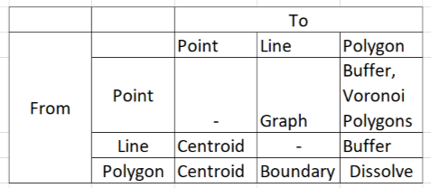
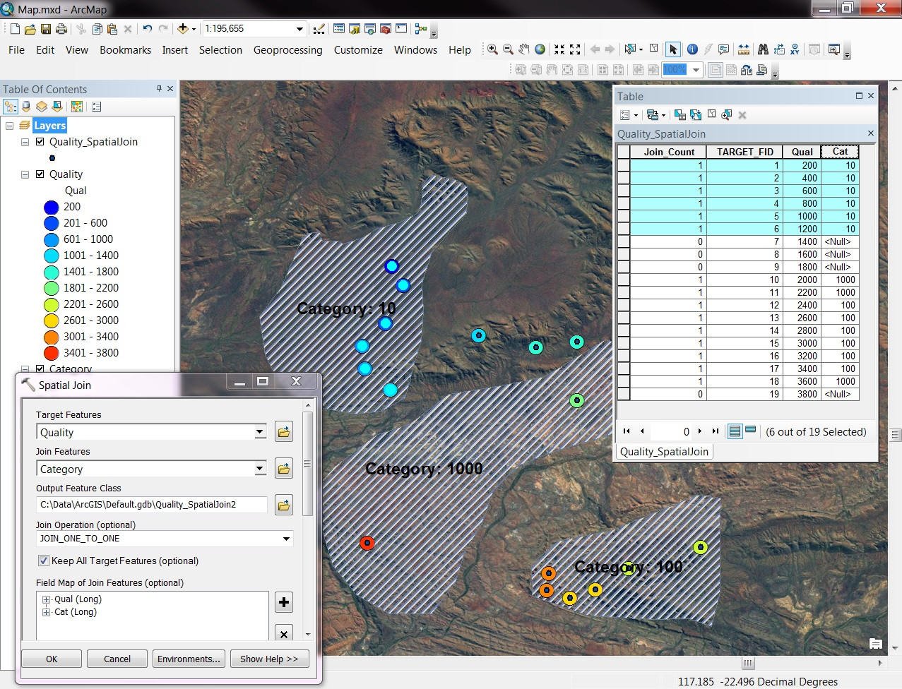

<style>
.column-left{
  float: left;
  width: 50%;
  text-align: left;
}
.column-right{
  float: right;
  width: 50%;
  text-align: right;
}
</style>


```{r setup, include=FALSE}
knitr::opts_chunk$set(echo = FALSE)
library(tidyverse)
library(knitr)
library(sf)
library(leaflet)
library(mapview)
library(xtable)
library(units)
library(dismo)
#world <- read_sf("world_shapefile/ne_50m_admin_0_countries.shp")
```

## Transforming Spatial Data

```{r, out.width="750px", fig.cap="", fig.align="center"}
include_graphics("Spatial_Data_Types.png")
```

## Transforming Spatial Data

**From Polygons to Points - Centroids**

- How far is it between São Paulo and the other municipalities in São Paulo?
    - We only have the polygon shapefile...
    - No single answer
    - But we can calculate the **centroids** of each polygon

```{r, results='asis'}
mun <- readRDS("mun2.rds") %>% st_as_sf()
SP <- mun %>% filter(UF=="SP")

SP %>% ggplot() +
  geom_sf() +
  theme_minimal() +
  coord_sf(datum=NULL)
```

## Transforming Spatial Data

**From Polygons to Points - Centroids**

- How far is it between São Paulo and the other municipalities in São Paulo?
    - We only have the polygon shapefile...
    - No single answer
    - But we can calculate the **centroids** of each polygon

```{r, results='asis'}
mun <- readRDS("mun2.rds") %>% st_as_sf() %>% st_set_crs(4326)
SP <- mun %>% filter(UF=="SP")

SP %>% st_centroid() %>% ggplot() +
  geom_sf() +
  theme_minimal() +
  coord_sf(datum=NULL)
```

## Transforming Spatial Data

**From Points to Polygons - Buffers**

- We want to find the area within 10km of each centroid

```{r, results='asis'}
mun <- readRDS("mun2.rds") %>% st_as_sf() %>% st_set_crs(4326)
SP <- mun %>% filter(UF=="SP")

SP %>% st_centroid() %>% ggplot() +
  geom_sf() +
  theme_minimal() +
  coord_sf(datum=NULL)
```

## Transforming Spatial Data

**From Points to Polygons - Buffers**

- We want to find the area within 10km of each centroid

```{r, results='asis'}
SP %>% st_centroid() %>% st_transform(22524) %>% st_buffer(dist=10000) %>% 
  ggplot() +
  geom_sf() +
  theme_minimal() +
  coord_sf(datum=NULL)
```

Transforming Spatial Data

**From Points to Polygons - Buffers**

- We want to create a continuous 
    - Each point in space is assigned to the polygon associated with the nearest point

```{r, results='asis'}
SP %>% st_centroid()  %>% st_transform(22524) %>% as("Spatial") %>% voronoi() %>% 
  st_as_sf() %>%
  ggplot() +
  geom_sf() +
  theme_minimal() +
  coord_sf(datum=NULL)

SP %>% st_centroid() %>% st_union() %>% st_voronoi() %>% 
  st_intersection(SP %>% st_union()) %>%
  ggplot() +
  geom_sf() +
  theme_minimal() +
  coord_sf(datum=NULL)

```

## Transforming Spatial Data

- Transformations:

```{r, out.width="750px", fig.cap="", fig.align="center"}

```

## Layers

- The power of spatial analysis comes from *combining* data sources
    - Spatial + Non-Spatial
    - Spatial + Spatial
    
- This helps us answer new questions:
    - Where are left-wing votes geographically clustered?
    - Are school results better north or south of the river?
    - Do places with less rainfall suffer more violence?

## Layers

- Spatial layers 'overlap' based on their common location attributes
    - CRUCIAL to have the same projection
    - Less important which projection

- Handling multiple layers:
    - Hard in Stata
    - Easy in GIS
    - Easy in R

## Layers

```{r, out.width="750px", fig.cap="", fig.align="center"}
include_graphics("Layers.jpg")
```

## Non-Spatial Joins

- Governments publish school performance data
    - But what is the spatial pattern of school performance? 
    - Better in the city centre or in the suburbs?

- We need a source for the location of the schools
    - Perhaps from a separate geographical survey
    - Or by georeferencing their addresses
    
- How do we combine the school performance and location datasets?
    - Join on a unique identifier
    - By code
    - By name?

## Non-Spatial Joins

[Add ex./illustration]

## Spatial Joins

- Do schools located in the cerrado ('savannah') perform better than those in other regions?
    - Two spatial data sources: school point locations, and cerrado area
    - Calculation: Average school performance by ecological region
    - But which schools are in which region?
    
- We need to overlay the schools on the map of the cerrado and 'add' the ecological region details to the school dataset

## Spatial Joins

```{r, out.width="750px", fig.cap="", fig.align="center"}

```
    

