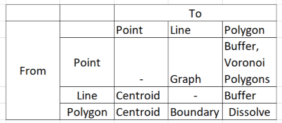
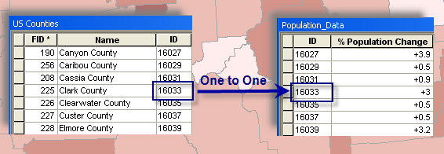
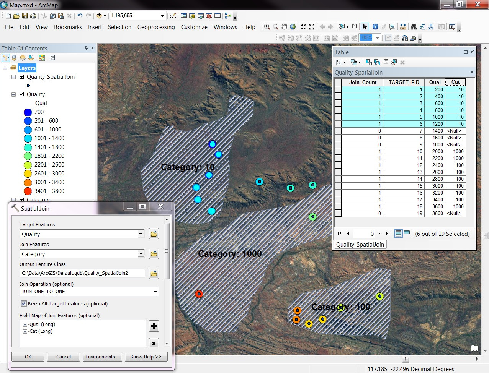
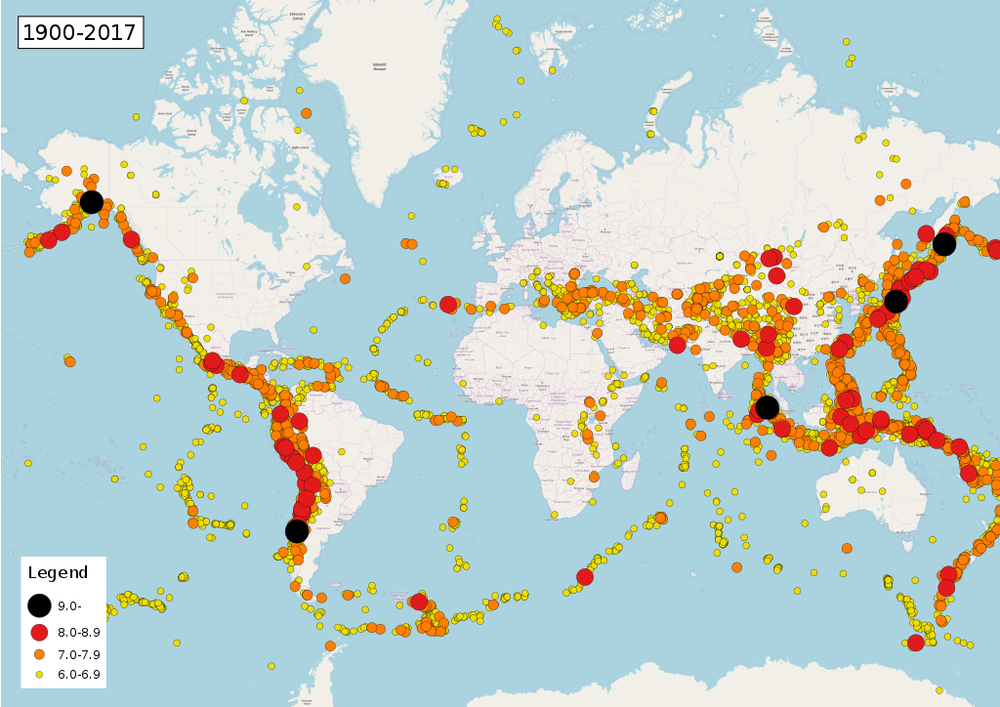
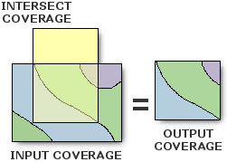
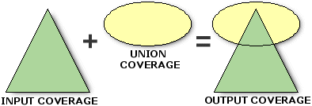

<style>
.column-left{
  float: left;
  width: 50%;
  text-align: left;
}
.column-right{
  float: right;
  width: 50%;
  text-align: right;
}
</style>


```{r setup, include=FALSE}
knitr::opts_chunk$set(echo = FALSE)
library(tidyverse)
library(knitr)
library(sf)
library(leaflet)
library(mapview)
library(xtable)
library(units)
library(dismo)
#world <- read_sf("world_shapefile/ne_50m_admin_0_countries.shp")
```

## Transforming Spatial Data

```{r, out.width="750px", fig.cap="", fig.align="center"}
include_graphics("Spatial_Data_Types.png")
```

## Transforming Spatial Data

**From Polygons to Points - Centroids**

- How far is it between São Paulo and the other municipalities in São Paulo?
    - We only have the polygon shapefile...

```{r, results='asis', warning=FALSE,fig.width=10,fig.height=5}
municipalities <- read_sf("../../Data/municipalities.shp")
SP <- municipalities %>% filter(UF=="SP")

SP %>% ggplot() +
  geom_sf() +
  theme_minimal() +
  coord_sf(datum=NA)
```

## Transforming Spatial Data

**From Polygons to Points - Centroids**

- How far is it between São Paulo and the other municipalities in São Paulo?
    - We only have the polygon shapefile...

```{r, results='asis', warning=FALSE,fig.width=10,fig.height=5}
SP %>% st_centroid() %>% ggplot() +
  geom_sf() +
  theme_minimal() +
  coord_sf(datum=NA)
```

## Transforming Spatial Data

**From Polygons to Points - Centroids**

- How far is it between São Paulo and the other municipalities in São Paulo?
    - A distance *vector*
    
```{r, warning=FALSE,fig.width=10,fig.height=5, results='asis'}
dists <- SP %>% st_centroid() %>% st_transform(22524)%>% filter(COD_MUN==3550308) %>% 
  st_distance(SP %>% st_centroid() %>% st_transform(22524))
dists %>% t() %>% as.data.frame() %>% sample_n(10) %>% kable()
```

## Transforming Spatial Data

**From Polygons to Points - Centroids**

- How far is it between each municipality in São Paulo?
    - A distance *matrix*
    
```{r, warning=F, warning=FALSE,fig.width=10,fig.height=5}
dists_all <- SP %>% st_centroid() %>% st_transform(22524) %>%
  st_distance()
dists_all[1:5,1:5] %>% as.data.frame() %>% kable()
```

## Transforming Spatial Data

**From Points to Polygons - Buffers**

- We want to find the area within 10km of each point

```{r, results='asis', warning=FALSE, error=F, message=F,fig.width=10,fig.height=5}
SP %>% st_centroid() %>% ggplot() +
  geom_sf() +
  theme_minimal() +
  coord_sf(datum=NA)
```

## Transforming Spatial Data

**From Points to Polygons - Buffers**

- We want to find the area within 10km of each point

```{r, results='asis', warning=FALSE, error=F, message=F,fig.width=10,fig.height=5}
SP %>% st_centroid() %>% st_transform(22524) %>% st_buffer(dist=10000) %>% 
  ggplot() +
  geom_sf() +
  theme_minimal() +
  coord_sf(datum=NA)
```

## Transforming Spatial Data

**From Points to Polygons - Voronoi Polygons**

- When we want no gaps between the polygons
    - Each point in space assigned to the nearest centroid

```{r, warning=FALSE,fig.width=10,fig.height=5, error=F, message=F}
outline <- st_union(SP %>% st_transform(22524) %>% st_union())

SP %>% st_centroid() %>% 
  ggplot() +
  geom_sf() +
  theme_minimal() +
  coord_sf(datum=NA)
```

## Transforming Spatial Data

**From Points to Polygons - Voronoi Polygons**

- When we want no gaps between the polygons
    - Each point in space assigned to the nearest centroid

```{r, warning=FALSE,fig.width=10,fig.height=5, error=F, message=F}
outline <- st_union(SP %>% st_transform(22524) %>% st_union())

SP %>% st_centroid() %>% st_transform(22524) %>% as("Spatial") %>% voronoi() %>% 
  st_as_sf() %>%
  ggplot() +
  geom_sf() +
  theme_minimal() +
  coord_sf(datum=NA)

```

## Transforming Spatial Data

**From Points to Polygons - Voronoi Polygons**

- When we want no gaps between the polygons
    - Each point in space assigned to the nearest centroid

```{r, warning=FALSE,fig.width=10,fig.height=5, error=F, message=F}
SP %>% st_centroid() %>% st_transform(22524) %>% as("Spatial") %>% voronoi() %>% 
  st_as_sf() %>%
  st_intersection(outline) %>%
  ggplot() +
  geom_sf() +
  theme_minimal() +
  coord_sf(datum=NA)

```

## Transforming Spatial Data

**From Points to Lines - Creating a Graph**

- How would we drive between the top 1% richest municipalities?

```{r, warning=FALSE,fig.width=10,fig.height=5}
SP %>% st_centroid() %>% ggplot() +
  geom_sf() +
  theme_minimal() +
  coord_sf(datum=NA)
```

## Transforming Spatial Data

**From Points to Lines - Creating a Graph**

- How would we drive between the top 1% richest municipalities?

```{r, warning=FALSE,fig.width=10,fig.height=5}
SP %>% st_centroid() %>% mutate(Upper=case_when(PIB_PER>quantile(SP$PIB_PER,0.99)~T,
                                          TRUE~F)) %>% 
  filter(Upper==TRUE) %>% 
  ggplot() +
  geom_sf(aes(col=Upper)) +
  theme_minimal() +
  coord_sf(datum=NA)
```

## Transforming Spatial Data

**From Points to Lines - Creating a Graph**

- How would we drive between the top 1% richest municipalities?

```{r, warning=FALSE,fig.width=10,fig.height=5}
SP %>% st_centroid() %>% mutate(Upper=case_when(PIB_PER>quantile(SP$PIB_PER,0.99)~T,
                                          TRUE~F)) %>% 
  group_by(Upper) %>%
  summarize(m=mean(Upper)) %>%
  st_cast("LINESTRING") %>%
  filter(Upper==TRUE) %>% 
  ggplot() +
  geom_sf(aes(col=Upper)) +
  theme_minimal() +
  coord_sf(datum=NA)
```

## Transforming Spatial Data

**From Polygons to Lines - Boundaries**

```{r, warning=FALSE,fig.width=10,fig.height=5}
SP %>%
  ggplot() +
  geom_sf() +
  theme_minimal() +
  coord_sf(datum=NA)
```

## Transforming Spatial Data

**From Polygons to Lines - Boundaries**

```{r, warning=FALSE,fig.width=10,fig.height=5}
SP %>% st_union() %>% st_cast("MULTILINESTRING") %>%
  ggplot() +
  geom_sf() +
  theme_minimal() +
  coord_sf(datum=NA)
```

## Transforming Spatial Data

**From Polygons to (bigger) Polygons - Dissolve**

- Aggregating municipal polygons to state polygons by dissolving internal boundaries

```{r, warning=FALSE,fig.width=10,fig.height=5}
municipalities %>%
  ggplot() +
  geom_sf() +
  theme_minimal() +
  coord_sf(datum=NA)

```

## Transforming Spatial Data

**From Polygons to (bigger) Polygons - Dissolve**

- Aggregating municipal polygons to state polygons by dissolving internal boundaries

```{r, warning=FALSE,fig.width=10,fig.height=5}
municipalities %>% group_by(UF) %>% summarize() %>%
  ggplot() +
  geom_sf() +
  theme_minimal() +
  coord_sf(datum=NA)

```

## Transforming Spatial Data

Summary of Transformations:

```{r, out.width="750px", fig.cap="", fig.align="center"}

```

## Layers

- The power of spatial analysis comes from *combining* data sources
    - Spatial + Non-Spatial
    - Spatial + Spatial
    
- This helps us answer new questions:
    - Where are left-wing votes geographically clustered?
    - Are school results better north or south of the river?
    - Do places with less rainfall suffer more violence?

## Layers

- Spatial layers 'overlap' based on their common location attributes
    - CRUCIAL to have the same projection
    - Less important which projection

- Handling multiple layers:
    - Hard in Stata
    - Easy in GIS
    - Easy in R

## Layers

```{r, out.width="550px", fig.cap="", fig.align="center"}
include_graphics("Layers.jpg")
```

## Non-Spatial Joins

- Governments publish school performance data
    - But what is the *spatial* pattern of school performance? 
    - Better in the city centre or in the suburbs?

- We need a source for the location of the schools
    - Perhaps from a separate geographical survey
    - Or by georeferencing their addresses
    
- How do we combine the school performance and location datasets?
    - Join on a unique identifier
    - By code
    - By name?

## Non-Spatial Joins

```{r, out.width="750px", fig.cap="", fig.align="center"}

```

## Spatial Joins

- Do schools located in the cerrado ('savannah') perform better than those in other regions?
    - Two spatial data sources: school point locations, and cerrado area
    - Calculation: Average school performance by ecological region
    - But which schools are in which region?
    
- We need to overlay the schools on the map of the cerrado and 'add' the ecological region details to the school dataset

## Spatial Joins

```{r, out.width="750px", fig.cap="", fig.align="center"}

```

## Points in Polygons

- How many earthquakes have occurred in each country?
    - Easy with a spatial join!

```{r, out.width="750px", fig.cap="", fig.align="center"}

```   

## Points in Polygons

- How many earthquakes have occurred in each country?
    - Easy with a spatial join!

Country | Number of Earthquakes
--------|-------------------------
China | 157
Indonesia | 113
Iran | 106
Turkey | 77
Japan | 61

## Spatial Relations

- With multiple layers, we can combine them to make *new* spatial objects
    - Not just to share attributes
    
<div class="column-left">
**Intersection**
- What portion of Minas Gerais is in the cerrado?

```{r, out.width="400px", fig.cap="", fig.align="center"}

```
</div>

<div class="column-right">
**Union**
- What land is *either* in Minas Gerais or in the cerrado?

```{r, out.width="400px", fig.cap="", fig.align="center"}

```
</div>

