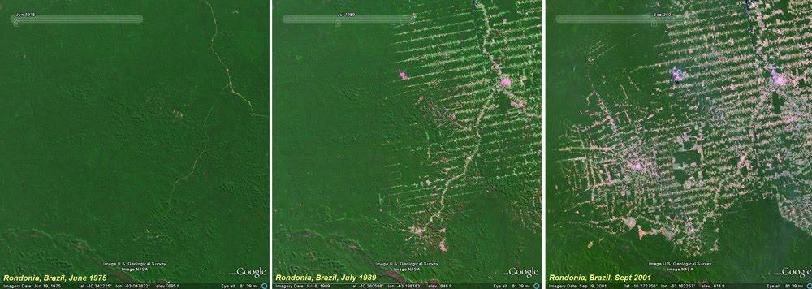
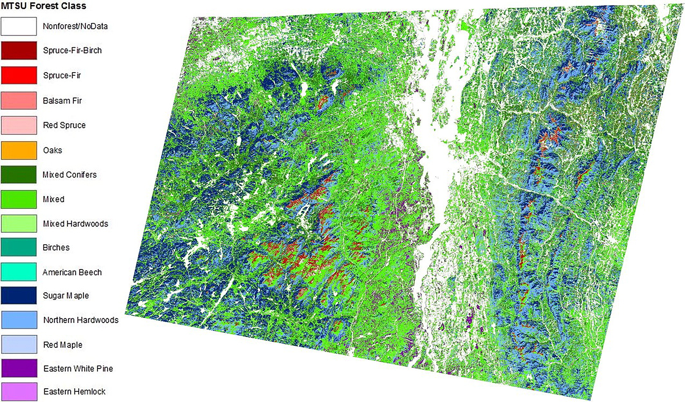
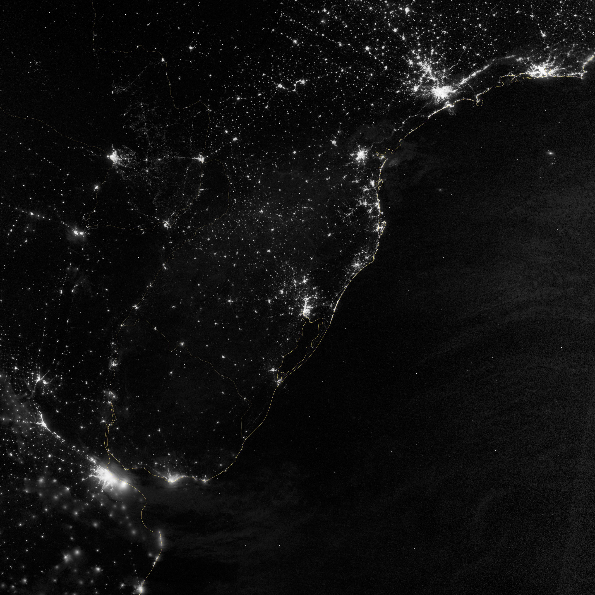
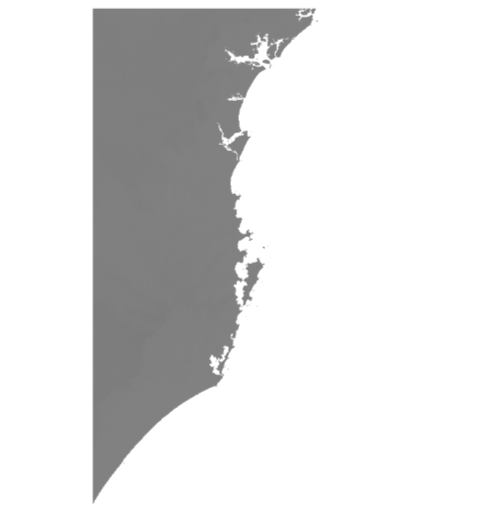
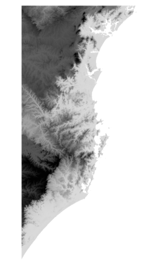
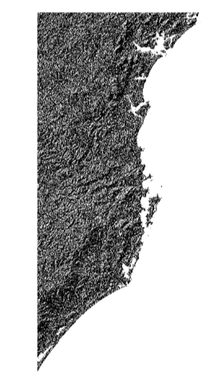
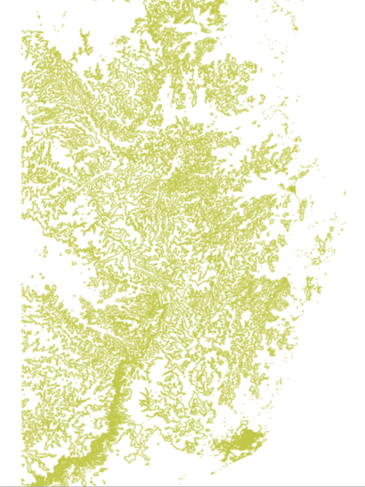
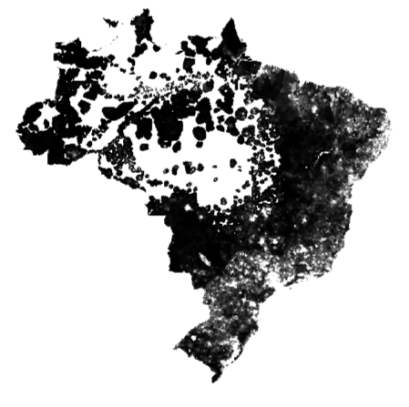

<style>
.column-left{
  float: left;
  width: 50%;
  text-align: left;
}
.column-right{
  float: right;
  width: 50%;
  text-align: right;
}
</style>


```{r setup, include=FALSE}
knitr::opts_chunk$set(echo = FALSE, warning=F, message=F, error=F)
library(tidyverse)
library(knitr)
library(sf)
library(leaflet)
library(mapview)
library(xtable)
library(units)
library(dismo)
#world <- read_sf("world_shapefile/ne_50m_admin_0_countries.shp")
```

## Raster Data
  
```{r, out.width="750px", fig.cap="", fig.align="center"}
include_graphics("raster.png")
```

## Raster Data

```{r, out.width="750px", fig.cap="", fig.align="center"}
include_graphics("Sentinel_Project.jpg")
```

## Raster Data

```{r, out.width="1300px", fig.cap="", fig.align="center"}

```

## Raster Data

```{r, out.width="1100px", fig.cap="", fig.align="center"}

```

## Raster Data

```{r, out.width="750px", fig.cap="", fig.align="center"}

```

## Raster Data

- Altitude Data
    - A Digital Elevation Model (DEM)

[http://srtm.csi.cgiar.org/srtmdata/](http://srtm.csi.cgiar.org/srtmdata/)

## Raster Data

- Satellites/planes capture a range of data depending on their sensors
    - Visible light, ultravoilet light, altitude, rain, gravity, etc.
    - Each 'band' is a separate raster image/layer
    - One band = greyscale
    - Multi-band = ex. Red, Green and Blue


## Raster Data
  
- Not a shapefile, because any image file (TIFF, BMP, PNG, JPEG) can be used
    - Don't think of colours, but numeric values for every pixel
     
- But we need to know *where* to map the pixels to the earth's surface
    - So usually a 'GeoTIFF'
    - Location defined by the corner pixels
    - Projection is still vital!

- Resolution determined by pixel size
    - Google Maps is about 10m - 50cm resolution, depending on location
    - Storage is a challenge
     
## Raster Data

```{r, out.width="750px", fig.cap="", fig.align="center"}
include_graphics("resolution.gif")
```


## Visualizing Raster Data

- Raster data often makes no sense to the human eye
    - May appear all black, or all white

- We have to focus on the interesting range of the data to make a clear contrast
    - QGIS tries to do this for us
    - Or we can 'manipulate' it manually

- 'Pseudocolour' is also useful for single band images

## Visualizing Raster Data

```{r, out.width="1000px", fig.cap="", fig.align="center"}
include_graphics("RBG.jpg")
```

## Visualizing Raster Data

```{r, out.width="1000px", fig.cap="", fig.align="center"}

```

## Visualizing Raster Data

- Scale: -32768 to 32768

```{r, out.width="550px", fig.cap="", fig.align="center"}

```

## Visualizing Raster Data

```{r, out.width="700px", fig.cap="", fig.align="center"}
include_graphics("Histogram.png")
```

## Visualizing Raster Data

- Scale: -5 to 1731

```{r, out.width="550px", fig.cap="", fig.align="center"}
include_graphics("DEM_2.png")
```

## Visualizing Raster Data

- Scale: -250 to 1380

```{r, out.width="550px", fig.cap="", fig.align="center"}

```

## Visualizing Raster Data

- Pseudocolour

```{r, out.width="550px", fig.cap="", fig.align="center"}
include_graphics("DEM_4.png")
```

## Visualizing Raster Data

- From Altitude to Slope: Digitel Elevation Model

```{r, out.width="550px", fig.cap="", fig.align="center"}

```


## Slope Analysis

- Raster to Vector: Contours
    
```{r, out.width="650px", fig.cap="", fig.align="center"}

```

## Raster Calculations

- Which pixels (places) are above >1000m?
    - Use a raster calculator
    - Pixels which are 'TRUE' show up in white
    
```{r, out.width="450px", fig.cap="", fig.align="center"}

```    

## Raster Calculations

- We can combine multiple rasters using basic maths
    - +, -, *, /
    
- Pixel values in each cell are combined to create a new raster

## Raster Calculations

- Population change (as measured by night lights)

```{r, cache=T}
popn_00 <- raster("Data/lacpopd00.tif/lacpopd00.tif", crs='+init=EPSG:4326')
popn_60 <- raster("Data/lacpopd60.tif/lacpopd60.tif", crs='+init=EPSG:4326')
```

```{r, cache=T}
popn_60 %>% as("SpatialPixelsDataFrame") %>% 
  as.data.frame() %>% 
  ggplot() + 
  geom_tile(aes(x=x,y=y, fill=lacpopd60)) +
  theme_minimal() +
  scale_fill_gradient(low="white",high="red",na.value="white",trans="log", name="Population Density") +
  coord_sf()
```

## Raster Calculations

- Population change (as measured by night lights)

```{r, cache=T}
popn_00 %>% as("SpatialPixelsDataFrame") %>% 
  as.data.frame() %>% 
  ggplot() + 
  geom_tile(aes(x=x,y=y, fill=lacpopd00)) +
  theme_minimal() +
  scale_fill_gradient(low="white",high="red",na.value="white",trans="log", name="Population Density") +
  coord_sf()
```

## Raster Calculations

- Population change (as measured by night lights)

```{r, cache=T}
popn_change_pct <- (popn_00 - popn_60)/popn_60

popn_change_pct %>% as("SpatialPixelsDataFrame") %>% 
  as.data.frame() %>% 
  ggplot() + 
  geom_tile(aes(x=x,y=y, fill=log(layer))) +
  theme_minimal() +
  scale_fill_gradient(low="white",high="red", na.value="white", trans="log", name="% Change in Population Density") +
  coord_sf()
```

## Rasters and Vectors

- To change the boundaries of the raster we can 'clip' it to a vector shapefile

```{r, out.width="650px", fig.cap="", fig.align="center"}
include_graphics("popn_1960.png")
```

## Rasters and Vectors

- To change the boundaries of the raster we can 'clip' it to a vector shapefile

```{r, out.width="600px", fig.cap="", fig.align="center"}

```

## Rasters and Vectors

- Sometimes the information in a raster is *too* detailed
- We can simplify by averaging the raster values according to specific polygons
    - Average altitude in each province
    - Average income by neighbourhood
    - Average rainfall by country
    
- These are called 'Zonal Statistics'
    - We can calculate lots of different statistics
    
## Rasters and Vectors

- To change the boundaries of the raster we can 'clip' it to a vector shapefile

```{r, out.width="600px", fig.cap="", fig.align="center"}

```

## Rasters and Vectors

Country     | Average Rainfall (mm/day)
------------|------------------------
Malaysia    | 8mm
Indonesia   | 12mm
Philippines | 4mm
Thailand    | 2mm
Singapore   | 5mm

## Machine Learning with Raster Data

[Poverty Mapping](https://jonnyphillips.github.io/Website/pov_map.html)

[Google Earth Engine](https://explorer.earthengine.google.com/)

[Collect Earth](http://collect.earth/home)

