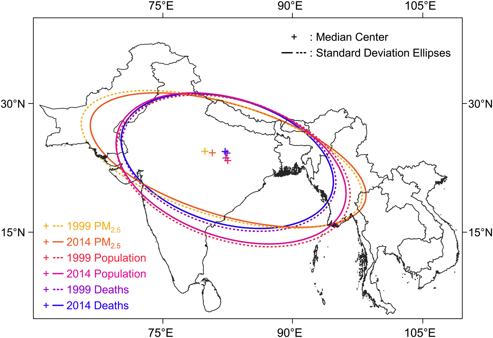
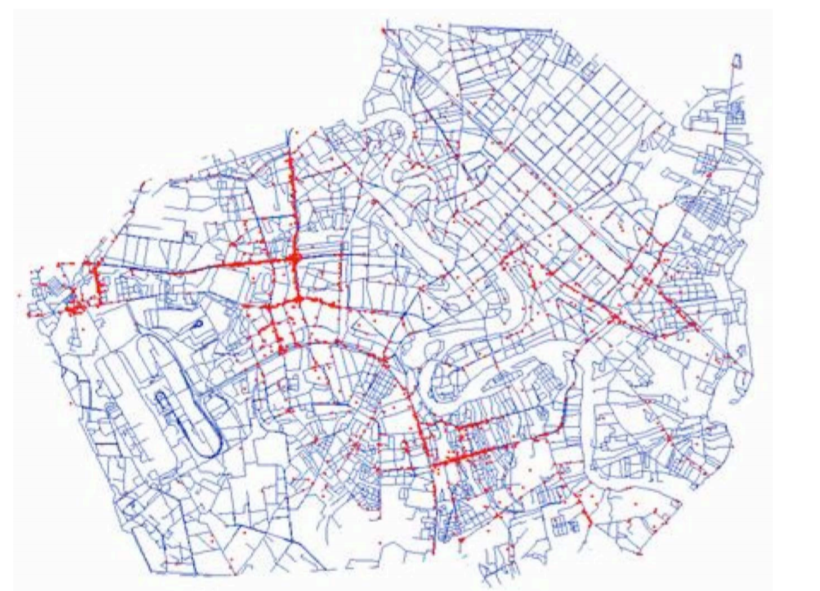
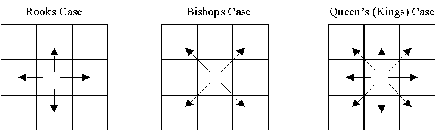
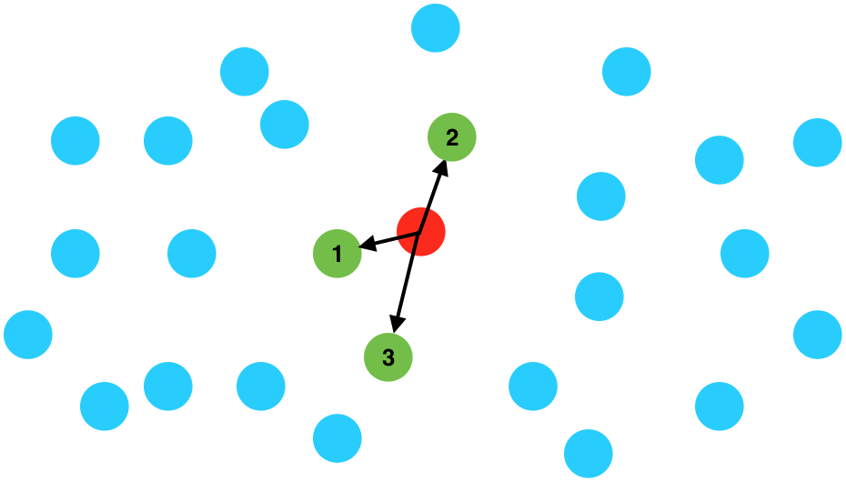

<style>
.column-left{
  float: left;
  width: 50%;
  text-align: left;
}
.column-right{
  float: right;
  width: 50%;
  text-align: right;
}
</style>


```{r setup, include=FALSE}
knitr::opts_chunk$set(echo = FALSE)
library(tidyverse)
library(knitr)
library(sf)
library(leaflet)
library(mapview)
library(xtable)
library(units)
library(dismo)
#world <- read_sf("world_shapefile/ne_50m_admin_0_countries.shp")
```


## Spatial Measurement

- What patterns in our data do we want to measure?  
    - Where events take place
    - Whether events are 'clustered' in space 
    - Whether attitudes are 'clustered' together (given fixed locations)
    - Whether groups are 'segregated' 

## Measures of Central Tendency

- What is the 'average' place where violence occurs in a city?
- What is the 'average' place where protests happen?

- We use the 'centroid', the average of all points' coordinates
    - Remember, nothing may happen at the average itself

## Measures of Central Tendency

```{r, out.width="700px", fig.cap="Centre of Mass of Brazilian Protests, 2013. Source: Bastos et al 2014", fig.align="center"}
include_graphics("Centroid_protests.jpg")
```

## Measures of Central Tendency

- We can also measure the 'distribution' of spatial events in two-dimensions
    - A 'spatial ellipse'
    - Location, dispersion and direction

## Measures of Central Tendency

```{r, out.width="750px", fig.cap="Population and Mortality in South Asia, Shi et al 2018", fig.align="center"}

```

## Spatial Point Patterns

- Is the location of protests random? Or do protestors target specific places?
- Is the distribution of hospitals in a city uniform or biased?

- We can calculate the number of 'events' (points) per $km^2$
    - But is the 'expected frequency' of an event constant across space?
    - Often crucial to take into account the background population

## Spatial Point Patterns

- Our null hypothesis is of 'complete spatial randomness'
    - Each location has an equal probability of an event occurring (poisson model)
    - How far away is our distribution of points from this random distribution?
    - Simple statistical test

## Spatial Point Patterns

```{r, out.width="720px", fig.cap="Location of Baghdad IEDs. Source: Anselin N.D.", fig.align="center"}
include_graphics("Point_pattern.png")
```

## Spatial Point Patterns

```{r, out.width="750px", fig.cap="Location of Baghdad IEDs. Source: Anselin N.D.", fig.align="center"}

```

## Clustering

- In many cases, our spatial units are fixed - states, homes, lakes - but we want to know if the *characteristics* of these objects follow any spatial pattern
    - First, we need to understand the 'space' we are working in

## Neighbours

- Remember the First Law of Geography?
- Spatial analysis depends on some units being closer to each other than others

- But when am I 'closer' to you?
    - 'Neighbours' are other units that are considered 'closer'
    
## Neighbours

1. Contiguity-based Neighbours
    - For polygons, contiguity means 'touching' 

```{r, out.width="750px", fig.cap="", fig.align="center"}

```    
    
## Neighbours

1. Contiguity-based Neighbours
    - Contiguity matrix

```{r, out.width="750px", fig.cap="", fig.align="center"}
include_graphics("Contiguity_Matrix.png")
```    
    
## Neighbours    

2. Distance-based Neighbours
    - Nearest-neighbour
    - Might not be 'close', but is 'closer'

```{r, out.width="750px", fig.cap="", fig.align="center"}

```    

## Clustering

- We want to measure how *similar* neighbouring units are
    - **Spatial Autocorrelation**

- Again, our benchmark is a spatially random distribution of characteristics across our units

## Clustering

```{r, out.width="750px", fig.cap="", fig.align="center"}
include_graphics("Spatial_randomness.png")
```

## Clustering

- Random is not one **end** of the scale, with clustering at the other end
    - Random data has clusters! Randomly!
    - Just not too many

- Random is the **middle** of the scale
    - Positive autocorrelation (clustering) on one end
    - Negative autocorrelation (dispersion) on the other end

## Clustering

```{r, out.width="750px", fig.cap="", fig.align="center"}
include_graphics("positive_negative.png")
```