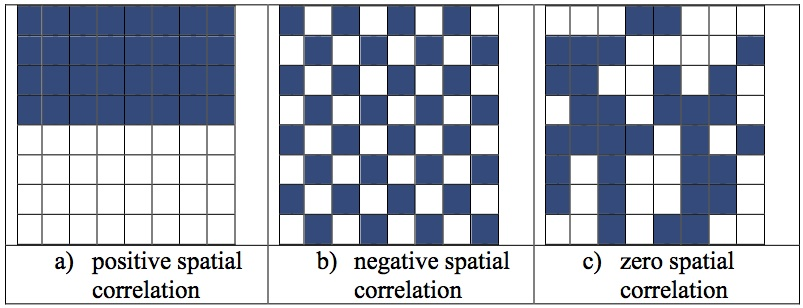
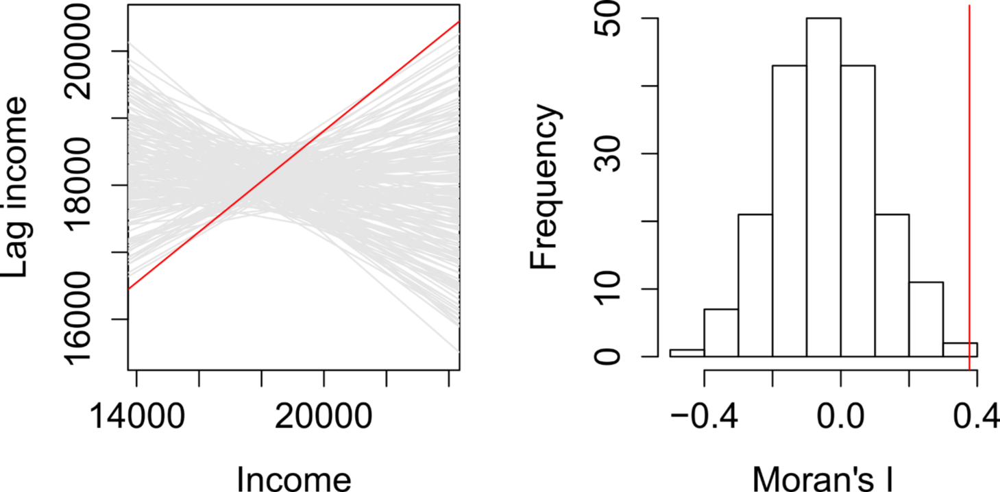

<style>
.column-left{
  float: left;
  width: 50%;
  text-align: left;
}
.column-right{
  float: right;
  width: 50%;
  text-align: right;
}
</style>


```{r setup, include=FALSE}
knitr::opts_chunk$set(echo = FALSE, warning=F, message=F, error=F)
library(tidyverse)
library(knitr)
library(sf)
library(leaflet)
library(mapview)
library(xtable)
library(units)
library(dismo)
#world <- read_sf("world_shapefile/ne_50m_admin_0_countries.shp")
```


## Spatial Measurement

- What patterns in our data do we want to measure?  
    - Where events take place
    - Whether events are 'clustered' in space 
    - Whether *characteristics* are 'clustered' together (given fixed locations)
    - Whether groups are 'segregated' 

## Measures of Central Tendency

- What is the 'average' place where violence occurs in a city?
- What is the 'average' place where protests happen?

- We use the 'centroid', the average of all points' coordinates
    - Remember, nothing may happen at the average itself

## Measures of Central Tendency

```{r, out.width="650px", fig.cap="Centre of Mass of Brazilian Protests, 2013. Source: Bastos et al 2014", fig.align="center"}

```

## Measures of Central Tendency

- We can also measure the 'distribution' of spatial events in two-dimensions
    - A 'spatial ellipse'
    - Location, dispersion and direction

## Measures of Central Tendency

```{r, out.width="750px", fig.cap="Population and Mortality in South Asia, Shi et al 2018", fig.align="center"}
include_graphics("Spatial_ellipse.jpg")
```

## Spatial Point Patterns

- Is the location of protests random? Or do protestors target specific places?
- Is the distribution of hospitals in a city uniform or biased?

- We can calculate the number of 'events' (points) per $km^2$
    - But is the 'expected frequency' of an event constant across space?
    - Often crucial to take into account the background population

## Spatial Point Patterns

- Our null hypothesis is of 'complete spatial randomness'
    - Each location has an equal probability of an event occurring (poisson model)
    - How far away is our distribution of points from this random distribution?
    - Simple statistical test
        - Is p<0.05?

## Spatial Point Patterns

```{r, out.width="600px", fig.cap="Location of Baghdad IEDs. Source: Anselin N.D.", fig.align="center"}

```

## Spatial Point Patterns

```{r, out.width="750px", fig.cap="Location of Baghdad IEDs. Source: Anselin N.D.", fig.align="center"}
include_graphics("Baghdad_IEDs.png")
```

## Spatial Point Patterns

```{r, out.width="550px", fig.cap="Location of Baghdad IEDs. Source: Anselin N.D.", fig.align="center"}

```

- Area: 44108 sq. metres
- Number of points; 62

- Average distance between points under Complete Spatial Randomness: 13.336m
- Average distance between points under Complete Spatial Randomness: 9.037m
- P-value: 0.0000006

## Clustering

- In many cases, our spatial units are fixed - states, homes, lakes - but we want to know if the *characteristics* of these objects follow any spatial pattern
    
- First, we need to understand the 'space' we are working in

## Neighbours

- Remember the First Law of Geography?
- Spatial analysis depends on some units being closer to each other than others

- But when am I 'closer' to you?
    - Full distance matrices are hard to calculate
    - So we normally just identify your 'neighbour'
    - 'Neighbours' are other units that are considered 'closer'
    
## Neighbours

1. Contiguity-based Neighbours
    - For polygons, contiguity means 'touching' 

```{r, out.width="1200px", fig.cap="", fig.align="center"}
include_graphics("Contiguity.gif")
```    
    
## Neighbours

1. Contiguity-based Neighbours
    - W = Spatial Weights Matrix (NxN)

```{r, out.width="850px", fig.cap="", fig.align="center"}

```    

## Neighbours    

2. Distance-based Neighbours
    - Usually used to identify 'nearest-neighbour' or $K$ nearest neighbours
    - Might not be 'close', but is 'closer'

```{r, out.width="750px", fig.cap="", fig.align="center"}
include_graphics("Nearest_neighbour.png")
```    

## Clustering

- We want to measure how *similar* neighbouring units are
    - The degree of **Spatial Autocorrelation**

- Again, our benchmark is a spatially random distribution of characteristics across our units

## Clustering

```{r, out.width="1200px", fig.cap="", fig.align="center"}
include_graphics("Spatial_randomness.png")
```

## Clustering

- Random is not one **end** of the scale, with clustering at the other end
    - Random data has clusters! Randomly!
    - Just not too many

- Random is more like the **middle** of the scale
    - Positive autocorrelation (clustering) on one end
    - Negative autocorrelation (dispersion) on the other end

## Clustering

```{r, out.width="1100px", fig.cap="", fig.align="center"}

```

## Clustering

```{r, out.width="1100px", fig.cap="", fig.align="center"}
include_graphics("positive_negative_2.png")
```

## Clustering

- Does this data look clustered? How much? How do we prove it?

```{r, cache=T, fig.height=6.5, fig.width=6.5}
electoral <- read_csv("Data/Pres_election_2014.csv")
muns <- read_sf("Data/municipalities.shp")

merged <- muns %>% left_join(electoral,by="COD_MUN")

merged %>% ggplot() + geom_sf(aes(fill=Pct_Votes), col=NA) + 
  theme_classic() +
  coord_sf(datum=NA)
```


```{r, out.width="450px", fig.cap="2016 US Presidential Vote Share", fig.align="center"}

```
    
## Clustering

- We need a measure of spatial autocorrelation (clustering)
    - When are two neighbours more likely to have similar characteristics than would be expected at random?
    
- Moran's I measure of Spatial Autocorrelation  
    - -1: Perfect negative autocorrelation
    -  0: No autocorrelation at all (in large samples)
    -  1: Perfect positive autocorrelation

## Clustering

```{r, out.width="750px", fig.cap="", fig.align="center"}
include_graphics("MoranI_scatter_plot.png")
```

## Clustering

- Moran's I:

$$ I = \frac{N}{W} \frac{\sum_i \sum_j w_{ij}(x_i - \bar{x})(x_j - \bar{x})}{\sum_i (x_i - \bar{x})} $$


where:  
$i$ and $j$ are are units    
$x_i$ and $x_j$ are the characteristic of interest for units $i$ and $j$  
$w_{ij}$ is the spatial weight between units $i$ and $j$  
$N$ is the total number of units  
$W$ is the sum of the spatial weights  

## Clustering

- Moran's I:
    - We can statistically test whether our value of Moran's I is higher or lower than we would expect if the characteristic was randomly distributed in space

```{r, out.width="600px", fig.cap="", fig.align="center"}

```

## Clustering

```{r}
merged %>% ggplot() + geom_sf(aes(fill=Pct_Votes), col=NA) + 
  theme_classic() +
  coord_sf(datum=NA)
```

## Clustering

- The Moran's I of Brazilian Presidential voting in 2014:
    - I = 0.85
    - Expected I = -0.00017
    - P-value = 0.00000001
    
```{r, cache=T}
library(sp)
library(spdep)
neighbours <- merged %>% as("Spatial") %>% coordinates() %>% knearneigh(k = 6) %>%
  knn2nb() 
weights <- neighbours %>% nb2listw(zero.policy=T)

moran_I <- moran(merged$Pct_Votes,weights,n=length(neighbours),Szero(weights),zero.policy=TRUE,NAOK=TRUE)$I  

moran_p <- moran.test(merged$Pct_Votes,weights,zero.policy=TRUE) 

```

## Clustering

- Spatial Autocorrelation is complicated and occurs at different distances
    - Not just among neighbours
    - We can look at patterns of spatial autocorrelation at **multiple scales** by using a Variogram
    
- A variogram shows the average squared difference in characteristics (eg. vote share) at distance $d$ for many distances

## Clustering

- Variogram

```{r, out.width="900px", fig.cap="", fig.align="center"}

```

## Clustering

```{r, out.width="1100px", fig.cap="", fig.align="center"}

```


## Local Clustering

- But Moran's I is a **global statistic**
    - It does not tell us *where* the clustering exists
    
- We can use the calculations of Moran's I to categorize *each unit*

- Local Indicators of Spatial Autocorrelation (LISA)
    - A 'High' unit in a 'High' cluster
    - A 'Low' unit in a 'Low' cluster
    - A 'High' unit in a 'Low' cluster -> Surprising!
    - A 'Low' unit in a 'High' cluster -> Surprising!

- We can also calculate the statistical significance of each unit's classification
    
## Local Clustering

```{r, cache=T}
lisa <- merged$Pct_Votes %>% localmoran(weights) %>% as.data.frame()

dz4 <- merged

    dz4$LISA_I <- lisa[,"Ii"]
    dz4$LISA_p <- lisa[,"Pr(z > 0)"]
    dz4$Pct_Votes_stdzd <- as.vector(scale(dz4$Pct_Votes))
    dz4$Pct_Votes_stdzd_lag <- lag.listw(weights,dz4$Pct_Votes_stdzd, NAOK=TRUE) #NAOK here helps or hinders?

    dz4$category <- "Insignificant"
    dz4$category[dz4$LISA_p<0.05 & dz4$Pct_Votes_stdzd>=0 & dz4$Pct_Votes_stdzd_lag>=0] <- "High-High"
    dz4$category[dz4$LISA_p<0.05 & dz4$Pct_Votes_stdzd>=0 & dz4$Pct_Votes_stdzd_lag<=0] <- "High-Low"
    dz4$category[dz4$LISA_p<0.05 & dz4$Pct_Votes_stdzd<=0 & dz4$Pct_Votes_stdzd_lag>=0] <- "Low-High"
    dz4$category[dz4$LISA_p<0.05 & dz4$Pct_Votes_stdzd<=0 & dz4$Pct_Votes_stdzd_lag<=0] <- "Low-Low"
    dz4$category <- as.factor(dz4$category)
    
    
dz4 %>% ggplot() + geom_sf(aes(fill=category), col=NA) + 
  theme_classic() +
  coord_sf(datum=NA)
```

## Local Clustering

```{r, out.width="600px", fig.cap="Romao et al 2017", fig.align="center"}

```

## Spatial Segregation

- Sometimes we want to study not a single characteristic but the distribution of multiple (>2) groups in space
    - Racial groups in cities
    - Skilled workers
    - Vote shares for multiple parties
    
- We want to know how 'segregated' these groups are into separate spatial areas

## Spatial Segregation

```{r, out.width="750px", fig.cap="Vaughan 1999", fig.align="center"}

```

## Spatial Segregation

[NYC Segregation, NY Times](https://pudding.cool/2018/10/city_3d/?fbclid=IwAR3GQtk3MgbwW3jMTNauYkzI82riDbJ8VnpXEREwuj3FPTwq21LaiMgbOKA)

[US Segregation, Washington Post](https://www.washingtonpost.com/graphics/2018/national/segregation-us-cities/?noredirect=on&utm_term=.e15de5bd71ba)

## Spatial Segregation

```{r, out.width="700px", fig.cap="", fig.align="center"}

```

## Spatial Segregation

- One approach is the Spatial Dissimilarity Index
    - A measure of evenness vs. clustering
    - On average, how different is the composition of each unit's local neighbourhood to the composition of the entire region as a whole?

0: Evenness  
1: Clustering (segregation)

## Spatial Segregation

$$D = \sum_n \sum_i \frac{N_n}{2NI} |t_{ni} - t_i|$$

where:  
$i$ indexes groups  
$n$ indexes neighbourhoods  
$N$ is the total population  
$t_i$ is the \% of group $i$ overall  
$t_{ni}=\frac{L_ni}{L_n}$ is the standardized intensity of group $i$ in neighbourhood $n$  
$I = \sum_i (t_i)(1-t_i)$

## Spatial Segregation

- Segregation (Black/White) in US Cities
    - Detroit: 0.867
    - New York: 0.843
    - Chicago: 0.836
    - San Francisco: 0.656
    - Jacksonville: 0.371
    

## Spatial Segregation

- Dissimilarity is a global measure
    - But we can also measure local dissimilarity

```{r, out.width="600px", fig.cap="Local Spatial Dissimilarity Index", fig.align="center"}

```

## Spatial Segregation

- Spatial Exposure: The average proportion of group $j$ in the neighbourhood of group $i$

```{r, out.width="600px", fig.cap="Exposure of White to Coloured Population (https://complexsystemstheory.net/complexity-of-segregation/)", fig.align="center"}

```

## Spatial Segregation

- Segregation is complicated
    - It varies a lot depending on the **scale** at which you assess it
    - And how we define each unit's **neighbourhood**
