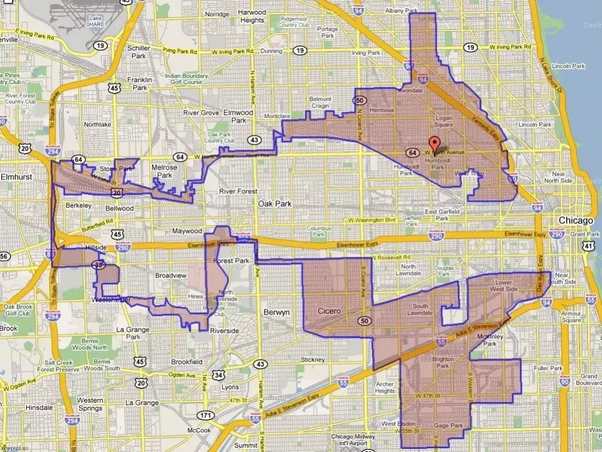
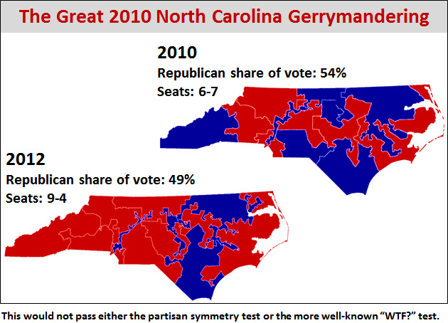
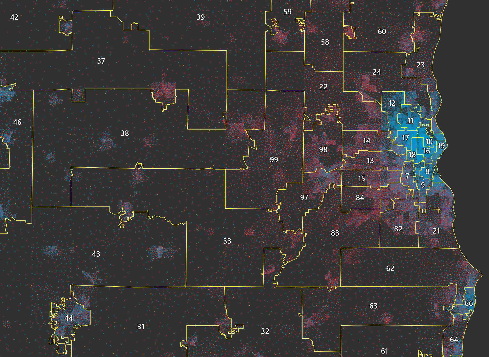
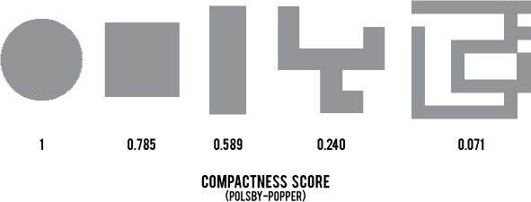
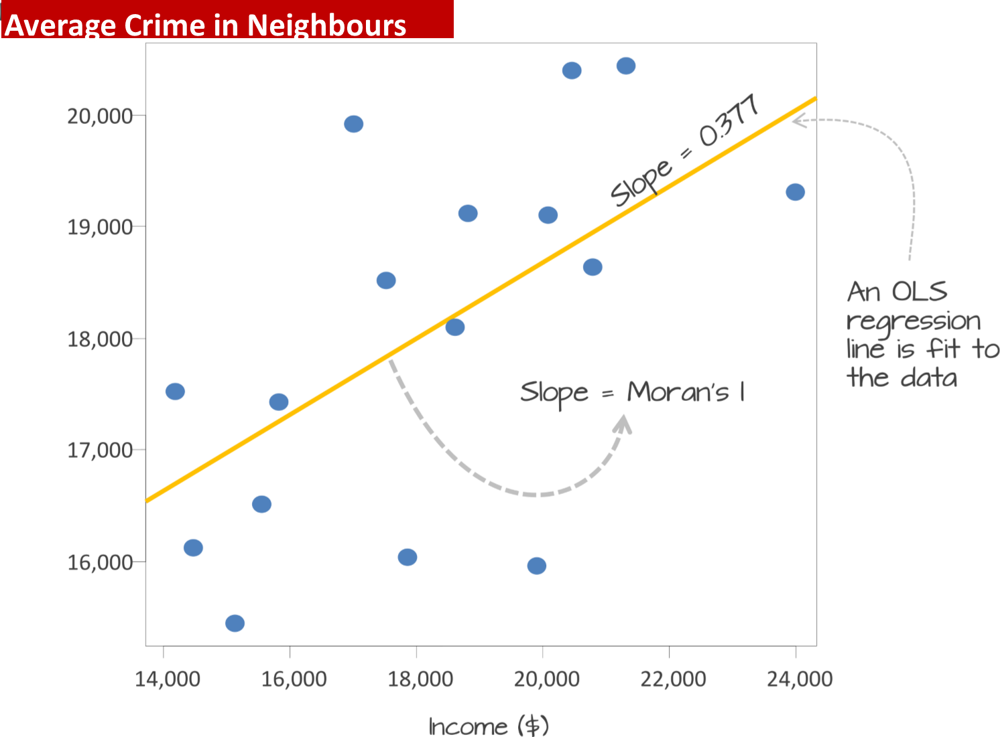
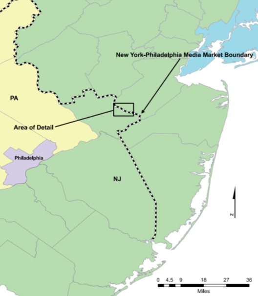
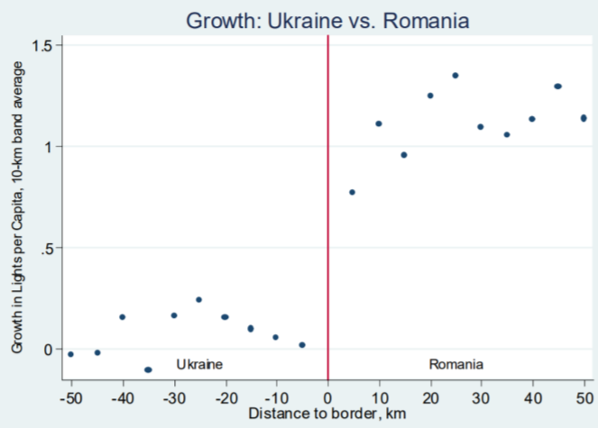
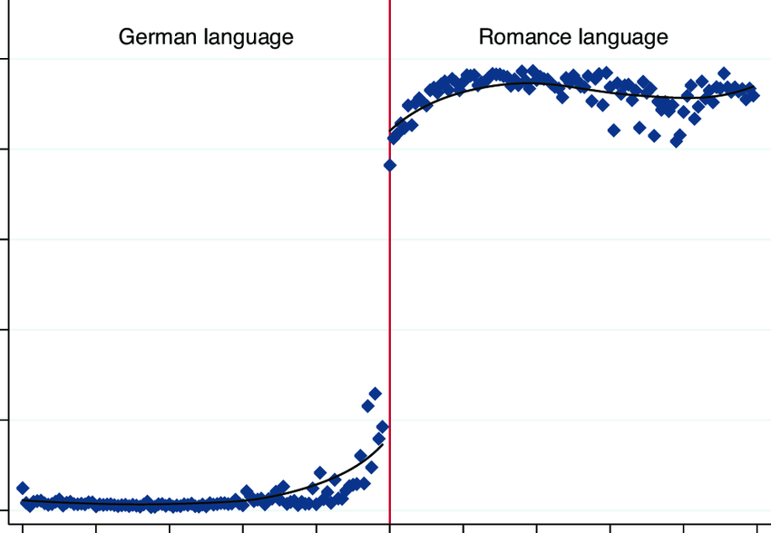

<style>
.column-left{
  float: left;
  width: 50%;
  text-align: left;
}
.column-right{
  float: right;
  width: 50%;
  text-align: right;
}
</style>


```{r setup, include=FALSE}
knitr::opts_chunk$set(echo = FALSE, warning=F, message=F, error=F)
library(tidyverse)
library(knitr)
library(sf)
library(leaflet)
library(mapview)
library(xtable)
library(units)
library(dismo)
#world <- read_sf("world_shapefile/ne_50m_admin_0_countries.shp")
```


## Political Science and Spatial Analysis

- Combining the methods we have learned helps you measure what it is you are interested in:
    - Average location
    - Clustered events
    - Clustered characteristics
    - Segregation

## Gerrymandering

- Geographers are in high demand in Washington DC
    - Politicians try to "pick their electorates"
    - Changing the shape of district boundaries to maximize their change of re-election
    - Taking advantage of the fact that most votes are 'wasted'
    
- "Packing" and "Cracking"
    - Packing your opponents into one district: They *only* get one seat
    - Cracking your opponents to divide them into multiple districts: No chance of any seats

## Gerrymandering

- Easier when politicians control the redistricting process
    - When voters are easily identified by race (a census variable)
    - When voters are clustered: They pack and crack themselves, eg. black voters
    - And because there is no 'correct' district shape: All maps have partisan effects
    
## Gerrymandering    
    
```{r, out.width="900px", fig.cap="", fig.align="center"}
include_graphics("Gerrymander.png")
```

## Gerrymandering    

```{r, out.width="900px", fig.cap="", fig.align="center"}

```

## Gerrymandering    

```{r, out.width="900px", fig.cap="", fig.align="center"}

```

## Gerrymandering    

```{r, out.width="900px", fig.cap="", fig.align="center"}

```

## Gerrymandering    

- Measuring Gerymandering
    - State constitutions: "Districts shall be **compact**..."
    - Efficiently taking up space: the most compact shape is a circle
    - >30 measures of compactness!

## Gerrymandering    

- One compactness test: Polsby-Popper
    - 0 = Low compactness
    - 1 = High compactness (a circle)

$$PP = \frac{4 \pi Area}{Perimeter^2}$$
## Gerrymandering    

```{r, out.width="900px", fig.cap="", fig.align="center"}

```

## Gerrymandering    

- Gerrymandering got better, but got worse since the 1970s

```{r, out.width="900px", fig.cap="", fig.align="center"}

```

## Gerrymandering    

- The Efficiency Gap is another test
    - How many votes did each party waste?
    - Votes in losing districts plus votes above 50% in winning districts
    - Find the difference between parties
    
- We can also create lots of random maps and measure bias
    - Compare to reality

## Spatial Correlations

- Moran's I helped us measure the clustering of a variable *with itself*
    - If **income** is high in unit $i$ is **income** also high in the neighbours of $i$?
    
- But political science questions are often about the relationship *between* variables
    - If **income** is high in unit $i$ is **voting** also high in the neighbours of $i$?
    - If **income** is high in unit $i$ is **crime** low in the neighbours of $i$?

## Spatial Correlations

- Bivariate Moran's I

```{r, out.width="900px", fig.cap="", fig.align="center"}

```

## Spatial Correlations

- Spatial econometrics is often the 'right' way to deal with these questions
    - A *model* of the relationship, not just a descriptive statistic
    - Requires more assumptions
    - But allows for control variables

- Normal regression is no good
    - Assumes no spatial autocorrelation
    - We need to *model* the spatial autocorrelatio so it doesn't create bias
    
## Border Effects

- How much do spatial patterns change at a border?
    - How can we measure this statistically?
    
- A Geographic Regression Discontinuity Design (GRD)
    - People who live on one side of a border are usually very similar to those on the other side on many 'confounding' variables (income, race, culture, history etc.)
    - They are just governed by different people/policies
    - We can use this to compare and make *causal* claims

## Border Effects

- For example:
    - The effect of the Habsburg Empire on voting today
    - The effect of the Peruvian 'Mita' on education
    - The effect of media markets on political attitudes

## Border Effects

```{r, out.width="900px", fig.cap="", fig.align="center"}

```

## Border Effects

- Nightlights on the Ukraine-Romania (Pinkovskiy 2013)

```{r, out.width="900px", fig.cap="", fig.align="center"}

```

## Border Effects

- Borders within Switzerland divide language speakers:

```{r, out.width="900px", fig.cap="", fig.align="center"}

```

## Border Effects

- Bihar-Jharkhand Border and Trust in the Civil Service:

```{r, out.width="900px", fig.cap="", fig.align="center"}
include_graphics("rddmap_trust_civil_service-1.pdf")
```
  
## Border Effects

- Regression estimate:
    - x=longitude, y=latitude

$$y_i = \alpha + \beta Border_i + f(+ y + x^2 + y^2 + x^3 + y^3 + x^4 + y^4 + x * y
+ x^2 * y^2 + x^3 * y^3 + x * y^2 + x * y^3 + x^2 * y + x^3 * y)) + \epsilon_i$$

- We care about the direction and significance of $\beta$
    - The effect of the border after controlling for gradual changes across space

## Border Effects

- But remember to ask: why is the border located there?
    - And can't people migrate?

